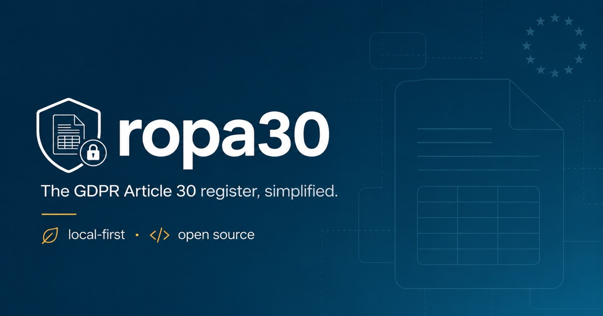

# ropa30

> Il registro dei trattamenti GDPR, semplice.

**ropa30** è un'applicazione web gratuita e open source che aiuta piccole imprese,
liberi professionisti, associazioni e Responsabili della Protezione dei Dati (DPO)
a tenere il proprio **Registro delle Attività di Trattamento** previsto
dall'articolo 30 del Regolamento UE 2016/679 (GDPR).

È progettata per essere radicalmente semplice — utilizzabile anche da chi non ha
competenze informatiche — pur restando rigorosa dal punto di vista giuridico
e della sicurezza.

🇬🇧 [Read this page in English](README.md)

> **Policy del repository.** Lo sviluppo primario avviene su **Codeberg**
> ([codeberg.org/nicfab/ropa30](https://codeberg.org/nicfab/ropa30)).
> Questo repository GitHub è un mirror in sola lettura, fornito per favorire la
> reperibilità. Apri issue e pull request su Codeberg.

---

## Documentazione

📖 **Guida utente (IT/EN):** [codeberg.org/nicfab/ropa30/wiki](https://codeberg.org/nicfab/ropa30/wiki)

---

## Perché ropa30?

La maggior parte degli strumenti per il registro dei trattamenti rientra in una
di queste tre categorie:

- **SaaS proprietari a pagamento** (OneTrust, Openli, Captain Compliance),
- **Applicazioni open source complesse** che richiedono Linux, Docker, Apache,
  MySQL o competenze equivalenti per essere installate e mantenute,
- **Modelli statici in foglio elettronico** (Excel, Word) facili da sbagliare
  e che diventano rapidamente obsoleti.

**ropa30 sceglie una strada diversa**: è un'applicazione web _local-first_.
La apri nel browser e funziona. Nessun server, nessun database da configurare,
nessun account da creare, nessun cloud a cui fidarsi.

---

## Principi cardine

- **🔒 Privacy by design, non per promessa.** I tuoi dati non lasciano mai
  il tuo dispositivo. Nessuna telemetria, nessun analytics, nessuna richiesta
  a terze parti, nessuna sincronizzazione cloud. Tutto è memorizzato localmente
  nel browser tramite IndexedDB.

- **🌍 Open source — AGPL-3.0.** Libero di usare, studiare, modificare,
  condividere. Qualsiasi opera derivata — compresi servizi web costruiti su
  ropa30 — deve restare open source. Stessa filosofia di Nextcloud, Mastodon,
  Bitwarden.

- **🧭 Conforme agli standard.** ropa30 implementa il modello dati definito da
  [UROPA](https://github.com/uropa-project/uropa) per piena interoperabilità
  con altri strumenti GDPR tramite import/export JSON standardizzato.

- **🌱 Semplicità "Steve Jobs".** Nessuna installazione, nessuna configurazione,
  nessun manuale obbligatorio. Una procedura guidata accompagna il primo
  utilizzo. Ogni campo dei moduli include spiegazioni in linguaggio chiaro dei
  concetti GDPR rilevanti.

- **🇪🇺 Infrastruttura europea e sovrana.** Lo sviluppo principale avviene su
  [Codeberg](https://codeberg.org/nicfab/ropa30), un'istanza Forgejo non-profit
  con sede a Berlino. Il mirror su GitHub esiste solo per visibilità.

---

## Funzionalità (roadmap)

### MVP (v1.0)

- [x] Struttura iniziale del progetto
- [ ] Modello dati locale (IndexedDB) per titolari, DPO e attività di trattamento
- [ ] Interfaccia bilingue (italiano / inglese) sin dal primo rilascio
- [ ] Procedura guidata di primo utilizzo
- [ ] Editor a moduli per ogni trattamento con tooltip GDPR in linguaggio chiaro
- [ ] Esportazione PDF con un click (pronta per richieste dell'Autorità Garante)
- [ ] Esportazione ODS (foglio elettronico modificabile)
- [ ] Backup / ripristino JSON + esportazione compatibile UROPA
- [ ] Offline-first (PWA completa, installabile come app desktop o mobile)

### Post-MVP

- [ ] Registro dei responsabili del trattamento (art. 30, par. 2)
- [ ] Backup cifrato opzionale (WebCrypto, AES-256)
- [ ] Audit di accessibilità WCAG 2.1 AA
- [ ] Tema scuro
- [ ] Modulo DPIA leggero (art. 35)

---

## Stato

🚧 **Sviluppo iniziale.** Stiamo costruendo l'MVP. Segui questo repository
oppure [@nicfab@fosstodon.org](https://fosstodon.org/@nicfab) per gli aggiornamenti.

---

## Licenza

ropa30 è rilasciato sotto **GNU Affero General Public License v3.0 o successiva**
(AGPL-3.0-or-later). Vedi [LICENSE](LICENSE) per il testo completo.

---

## Autore

**Nicola Fabiano** — Avvocato, founding partner di
[Studio Legale Fabiano](https://fabiano.law), DPO certificato, ForHumanity
AI Act Certified Auditor, contributor CEN-CENELEC JTC 21 (prEN 18274),
membro dell'EDPB Support Pool of Experts.

- Blog: [nicfab.eu](https://nicfab.eu)
- Mastodon: [@nicfab@fosstodon.org](https://fosstodon.org/@nicfab)
- arXiv: [pagina autore](https://arxiv.org/a/fabiano_n_2.html)

---

## Contributi

I contributi sono benvenuti — segnalazioni di bug, richieste di funzionalità,
traduzioni e pull request. Vedi [CONTRIBUTING.md](docs/CONTRIBUTING.md) (in arrivo).

Per segnalazioni di sicurezza, fai riferimento a [SECURITY.md](docs/SECURITY.md)
(in arrivo) e **non** aprire issue pubbliche.
